# AgentFarm Optimizer — Fallback Handling

This document explains **every degradation path** in the backend: what fails, what the system does next, and how to see which fallback ran. For pipeline structure, see [ARCHITECTURE.md](ARCHITECTURE.md). For setup, see [README.md](README.md).

---

## Design principles

1. **Complete the demo** — The scenario pipeline should return a plan and KPIs whenever inputs are valid, even if external APIs or optional services are down.
2. **Fail loud in metadata** — Fallbacks set `weather_source`, `fallback_mode`, agent traces, and `human_review` so operators know what degraded.
3. **Live weather on weather fallback** — When OpenWeather is unavailable, all farms use **`live_weather` rules** (not scripted heat/monsoon overlays). The user’s selected scenario is preserved as `requested_scenario_type` for transparency only.
4. **Never crash the weather step** — `fetch_weather()` never raises; it always returns `{events, meta}`.
5. **Postgres required at startup; Redis optional** — The app starts without Redis ping; caches and advisor sessions degrade.
6. **Last-mile comms without internet** — When farmers and drivers lack broadband or smartphone data, the system still delivers pickup instructions via **cellular SMS and optional voice** after FPO approval. The optimizer may run on a connected control-room link; field actors only need a basic mobile signal.

---

## Master fallback map

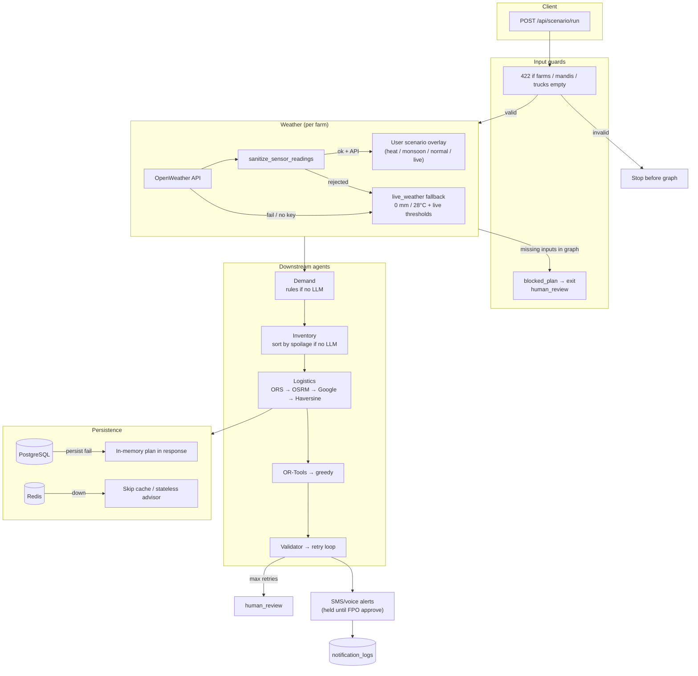

---

## 1. Pipeline input fallbacks

### 1.1 API validation (HTTP 422)

Before the LangGraph pipeline runs, `POST /api/scenario/run` rejects empty inputs:

| Missing input | HTTP | Message |
|---------------|------|---------|
| `farms: []` | 422 | `farms list is empty` |
| `demand_points: []` | 422 | `demand_points list is empty` |
| `trucks: []` | 422 | `trucks list is empty` |

**Module:** `backend/routes/scenario.py` → `_validate_scenario_inputs()`

### 1.2 Graph short-circuit (`blocked_plan`)

If the graph is invoked directly with missing inputs (e.g. tests), the orchestrator sets `pipeline_blocked: true` and routing skips weather → demand → inventory → logistics → validator.

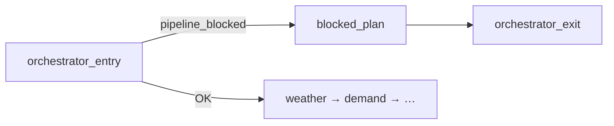

**Result:**
- `route_plan.routes = []`, notes: `blocked: insufficient inputs`
- `validation_result.valid = false`
- `human_review = true`
- Trace agent: `blocked_plan`

**Module:** `backend/graph.py` → `blocked_plan_node`

---

## 2. Weather fallbacks

Weather is fetched **per farm** from OpenWeather (lat/lng). There are **no physical IoT sensors** — “sensor readings” in code mean **API temperature and rainfall values**.

### 2.1 Happy path vs fallback path

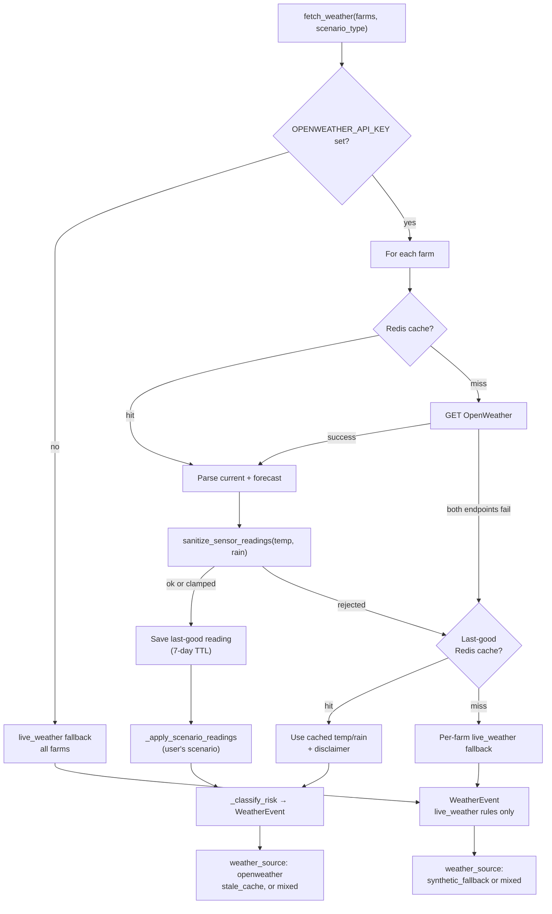

### 2.2 Stale cache fallback (per farm)

When OpenWeather fails for a farm but a **previous successful reading** exists in Redis (`weather2:last:{lat}:{lng}`, **7-day TTL**), the system reuses that farm's cached temperature and rainfall instead of the 0 mm / 28°C baseline.

| Field | Value |
|-------|-------|
| `weather_source` | `stale_cache` (all farms stale) or `mixed` |
| `fallback_mode` | `stale_cache` or `partial_stale_cache` |
| `stale_reading` | `true` |
| `weather_disclaimer` | *Couldn't fetch the current weather update; showing the most recently fetched reading.* |
| `reading_fetched_at` | ISO timestamp of last successful fetch |

**Triggers:** Both current and forecast API calls fail, or `sanitize_sensor_readings()` returns `rejected`, **and** a last-good key exists for that farm.

**UI:** **Last Known Weather** badge + orange disclaimer line (with optional reading age).

### 2.3 live_weather fallback (no API, no stale cache)

When OpenWeather cannot be used, **every affected farm** gets:

| Field | Fallback value |
|-------|----------------|
| Rain | 0 mm |
| Temp | 28°C |
| Scenario applied | **`live_weather` only** (no heat/monsoon/normal overlay) |
| Typical severity | `normal` |
| Description | `live_weather; rain=0.0mm; temp=28.0C; risk=normal` |

**Important:** If the user selected **Heat Wave** or **Monsoon** in the UI but the API is down, the fallback does **not** force 39°C or heavy rain. It uses live_weather classification on the mild baseline.

**Triggers:**
- `OPENWEATHER_API_KEY` not set
- Both current and forecast API calls fail for a farm **and** no last-good cache
- `sanitize_sensor_readings()` returns `rejected` **and** no last-good cache
- Redis/client error in outer `fetch_weather` try block

**Modules:** `backend/tools/weather_api.py`  
- `_live_weather_fallback_event()`  
- `_live_weather_fallback_batch()`  
- `_live_weather_fallback_farm_meta()`

### 2.4 Reading sanitization (`sanitize_sensor_readings`)

Guards against absurd API values before they skew risk classification.

| Quality | Condition | Action |
|---------|-----------|--------|
| `ok` | Temp −10…55°C, rain 0…500 mm | Use as-is |
| `clamped` | Slightly out of range | Cap to bounds |
| `rejected` | Temp &lt; −50 or &gt; 80°C, rain &gt; 1000 mm, negative rain | **Stale cache** if available, else **live_weather fallback** |

### 2.5 When OpenWeather **works** — scenario overlays

If API data is present, the **user’s selected scenario** adjusts readings:

| Scenario | Overlay behavior |
|----------|------------------|
| `live_weather` | No overlay — classify from observed rain/temp |
| `normal_day` | Clear rain, moderate 28°C |
| `heat_wave` | Temp bumped to ≥39°C |
| `monsoon_disruption` | High-risk-zone farms get ≥28 mm rain |

### 2.6 Effective scenario after full fallback

Weather runs **before** demand in the graph. When `weather_source === synthetic_fallback`:

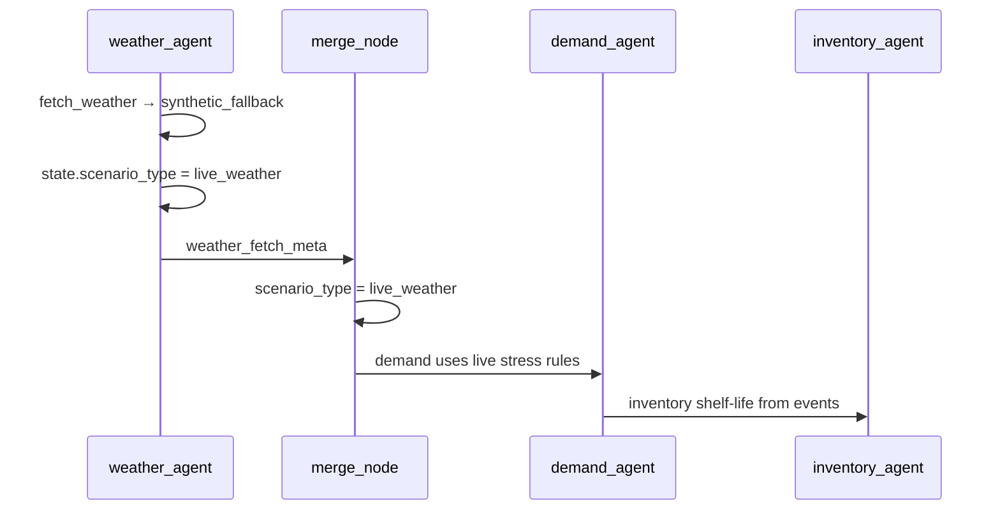

**Meta fields set on fallback:**

| Field | Meaning |
|-------|---------|
| `weather_source` | `openweather` \| `stale_cache` \| `mixed` \| `synthetic_fallback` |
| `requested_scenario_type` | What the user picked in the UI |
| `effective_scenario_type` | `live_weather` when fully synthetic |
| `fallback_mode` | `stale_cache`, `partial_stale_cache`, `live_weather`, or `partial_live_weather` |
| `scenario_modifier_applied` | `false` on full synthetic fallback |
| `weather_disclaimer` | Shown when stale readings are used |
| `synthetic_reason` | Human-readable cause |

### 2.7 UI signals (weather panel)

| `weather_source` | Badge / headline |
|------------------|------------------|
| `openweather` + `live_weather` | **Live (OpenWeather API)** |
| `openweather` + scripted scenario | **Live** + scenario overlay text |
| `stale_cache` | **Last Known Weather** + disclaimer |
| `synthetic_fallback` | **Simulated Weather** + live fallback headline |
| `mixed` | Live + partial fallback / stale disclaimer tooltip |

**Frontend:** `frontend/src/utils/weatherSummary.js`, `WeatherRiskPanel.jsx`

---

## 3. Distance / routing fallbacks

The logistics agent builds a distance matrix for OR-Tools. Each origin–destination pair walks this chain:

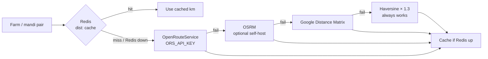

| Step | Env var | On failure |
|------|---------|------------|
| Redis cache | `REDIS_URL` | Skip cache; continue chain |
| OpenRouteService | `ORS_API_KEY` | Log warning; try OSRM |
| OSRM | `OSRM_URL` + Docker `--profile self-host` | Try Google |
| Google | `GOOGLE_MAPS_API_KEY` | Use Haversine |
| Haversine × 1.3 | — | Straight-line × road factor; no network |

**Module:** `backend/tools/maps_api.py` (`_cache_get`, `_cache_set`, `get_distance_matrix`)

**Note:** Haversine is less accurate than road routing but keeps the VRP solver running during internet outages.

---

## 4. VRP and validator fallbacks

### 4.1 OR-Tools → greedy

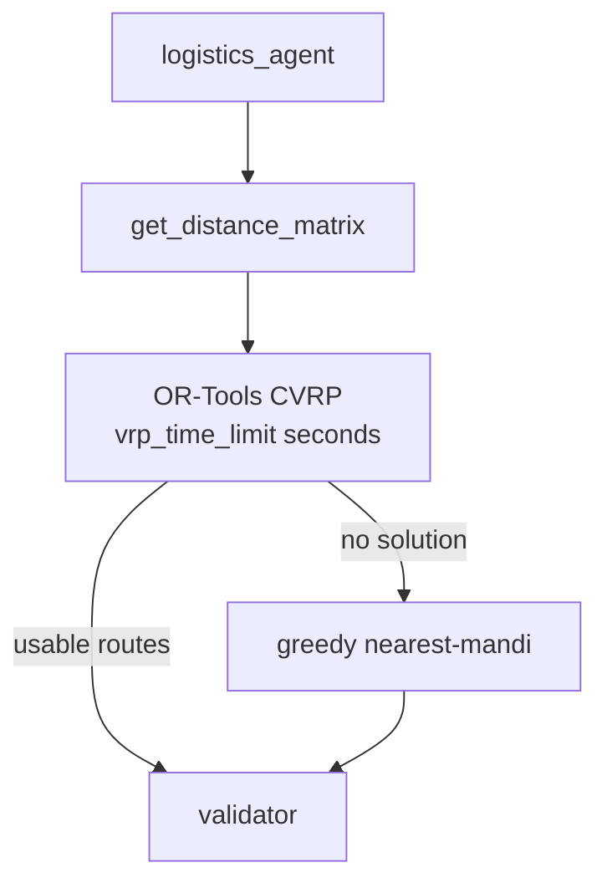

- Greedy plan notes: `greedy_nearest_mandi_fallback`
- **Module:** `backend/tools/vrp_solver.py`

### 4.2 Validator retry loop

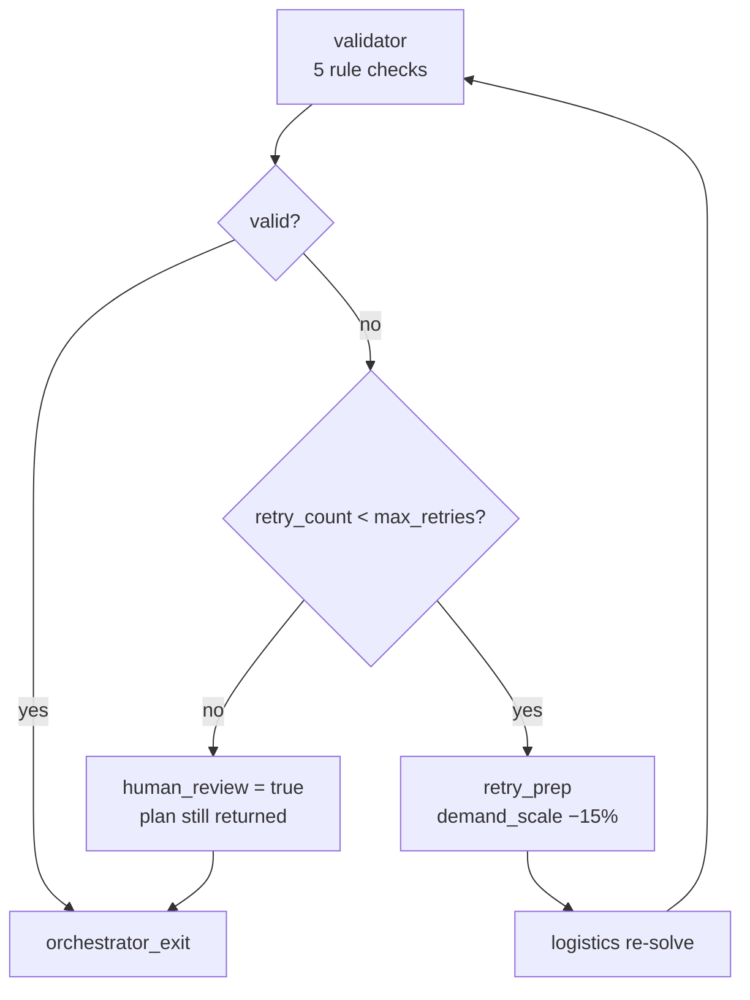

| Check | What it enforces |
|-------|------------------|
| Capacity | Truck load ≤ `capacity_kg` |
| Availability window | Route duration ≤ truck hours |
| Severe weather | Don’t route through severe farm if same-crop safer farm exists |
| Driver hours | ≤ 14 h driving per truck |
| Urgent spoilage | Farms with &lt; 12 h remaining must be on a route |

**Config:** `max_retries` (default **2**) in `backend/config.py`

**Retry behavior:** `demand_scale` = 1.0 → 0.85 → 0.70 (min 0.65) so loads fit capacity.

### 4.3 All-severe weather

When **every** farm is `severe`, the validator adds a warning (`ALL_SEVERE_WEATHER`) instead of blocking routes that have no safer alternative.

**Module:** `backend/agents/validator.py` → `_all_severe_weather()`

### 4.4 Logistics extras

| Situation | Fallback |
|-----------|----------|
| Missing farms, mandis, or trucks inside logistics | Empty `RoutePlan`, `skipped: missing inputs` |
| Region with no truck assigned | Reuse **last truck** in fleet |
| More clusters than trucks | Merge nearest clusters |
| Route history DB unavailable | `route_history_factor = 1.0` (no distance inflation) |

---

## 5. LLM fallbacks (optional)

LLM agents are **enhancements**. The pipeline runs without `OPENAI_API_KEY`.

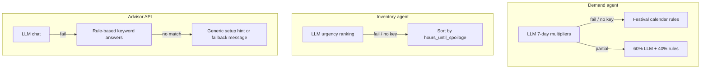

| Agent | Primary | Fallback | Module |
|-------|---------|----------|--------|
| Demand | GPT via OpenRouter/OpenAI | Festival rules (Diwali, Pongal, Holi, Navratri) | `demand_agent.py` |
| Inventory | LLM re-rank | Ascending spoilage urgency | `inventory_agent.py` |
| Advisor | LLM (temp 0.3) | `_try_rule_based_answer()` → canned reply | `advisor_agent.py` |

**Demand bias correction:** Outcome history from DB; returns **1.0** if query fails or no history.

---

## 6. Database (PostgreSQL) fallbacks

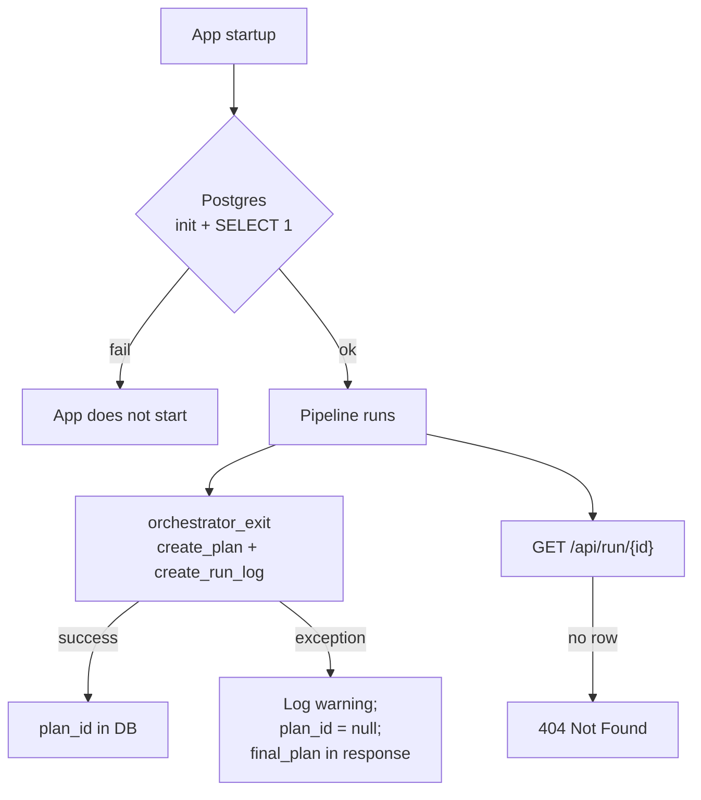

| Operation | DB down / error | Behavior |
|-----------|-----------------|----------|
| Startup | Yes | App **won’t start** |
| Persist plan | Mid-run | Skip; return in-memory plan |
| Outcome history | Query fail | Bias/factor defaults to 1.0 |
| Advisor load plan | Fail | Empty context; rules/generic reply |
| GET run weather | Redis miss | Fall back to `weather_snapshot` in Postgres run_log |

**Module:** `backend/agents/orchestrator.py`, `backend/tools/db.py`

---

## 7. Redis fallbacks

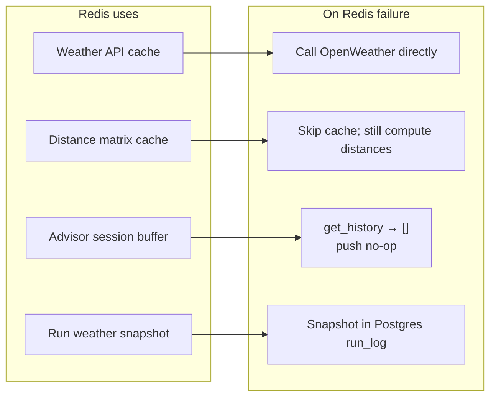

| Use | Module | On failure |
|-----|--------|------------|
| Weather cache | `weather_api.py` | Ignore cache errors |
| Distance cache | `maps_api.py` | `_cache_get` / `_cache_set` no-op |
| Advisor sessions | `session_buffer.py` | Stateless Q&A (no chat memory) |
| Weather snapshot | `weather_store.py` | Best-effort; Postgres backup |
| Startup ping | `main.py` | App **still starts**; `/health/ready` → 503 for redis |

---

## 8. Health endpoints

| Endpoint | Purpose | Failure response |
|----------|---------|------------------|
| `GET /health` | Liveness — process up | Always `200` `{"status":"ok"}` |
| `GET /health/ready` | Postgres + Redis | `503` + `checks` object if either fails |

**Module:** `backend/main.py`

---

## 9. Advisor service fallbacks (on-demand)

Separate from the main pipeline graph; called via `POST /api/advisor/query`.

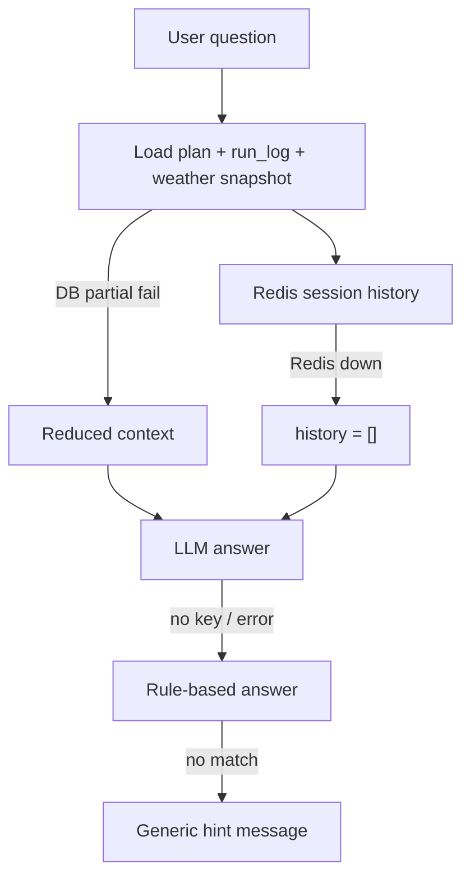

Data loaders (`_load_plan_row`, `_load_run_detail`, `_load_name_maps`) each catch exceptions and return empty/null rather than 500.

---

## 10. KPI / metrics fallbacks

`compute_kpi_delta()` handles incomplete route data:

- Routes with no mandi stop → assign farm to **nearest mandi by Haversine**
- Missing distances → baseline comparison uses available data

**Module:** `backend/agents/metrics.py`

---

## 11. Observability cheat sheet

Use these fields to determine which fallback ran:

| Signal | Location | Values / meaning |
|--------|----------|------------------|
| `weather_fetch_meta.weather_source` | API / run snapshot | `openweather`, `stale_cache`, `mixed`, `synthetic_fallback` |
| `weather_fetch_meta.fallback_mode` | API / run snapshot | `stale_cache`, `partial_stale_cache`, `live_weather`, `partial_live_weather` |
| `weather_summary.weather_disclaimer` | Dashboard | Stale-reading message |
| `weather_fetch_meta.requested_scenario_type` | API | User’s UI selection |
| `weather_fetch_meta.effective_scenario_type` | API | `live_weather` when fully synthetic |
| `weather_summary.synthetic_reason` | Dashboard | Why fallback triggered |
| `farm_readings[].data_quality` | Weather snapshot | `ok`, `clamped`, `rejected`, `stale_cache` |
| `farm_readings[].stale_reading` | Weather snapshot | `true` when showing cached reading |
| `route_plan.notes` | Plan | `greedy_nearest_mandi_fallback`, `blocked: insufficient inputs`, … |
| `agent_traces[].agent_name` | Traces API | `blocked_plan`, `retry_prep`, `validator`, … |
| `validation_result.warnings` | Plan | `ALL_SEVERE_WEATHER`, … |
| `human_review` | Scenario response | `true` = max retries or blocked inputs |
| `approval_status` | `GET /api/run/{id}` | `pending` / `approved` / `dispatched` |
| `notifications_dispatched_at` | Plan row / run API | When FPO-triggered SMS/voice went out |
| `GET /api/run/{id}/notifications` | Audit API | Per-phone send status, channel, message body |
| `GET /health/ready` | Ops | `503` = Postgres or Redis unhealthy |

---

## 12. What still works when X is down?

| Failure | Pipeline run? | Routes? | Weather panel? | Advisor? | Farmer SMS/voice? |
|---------|---------------|---------|----------------|----------|-------------------|
| No OpenWeather key | ✅ | ✅ | Simulated + live fallback rules | ✅ | ✅ after FPO approve* |
| Internet outage (no routing APIs) | ✅ | ✅ (Haversine) | Simulated if no OW | ✅ | ✅ after FPO approve* |
| Redis down | ✅ | ✅ | ✅ if OW key works | ✅ (no memory) | ✅ after FPO approve* |
| DB down mid-run | ✅ | ✅ | ✅ | Limited context | ⚠️ audit log may fail |
| DB down at startup | ❌ | — | — | — | — |
| 0 trucks | ❌ **422** | — | — | — | — |
| OR-Tools timeout | ✅ | Greedy routes | — | — | ✅ after FPO approve* |
| Validator can’t fix plan | ✅ | Plan + `human_review` | — | — | ✅ after FPO approve* |
| `NOTIFY_ENABLED=false` | ✅ | ✅ | ✅ | ✅ | ❌ skipped |
| Before FPO approval | ✅ | ✅ | ✅ | ✅ | ⏸ held |

\* Requires `NOTIFY_ENABLED=true`, farm `notify_opt_in`, phone on file, and `POST /api/run/{run_id}/approve`. Farmers/drivers do **not** need internet — only GSM/SMS-capable phones.

---

## 13. Automated tests

```bash
cd backend
pytest tests/test_resilience -q
```

| Test file | Covers |
|-----------|--------|
| `test_bad_sensor_data.py` | `sanitize_sensor_readings` clamp/reject |
| `test_internet_outage.py` | Routing APIs down → Haversine; weather synthetic |
| `test_db_down.py` | Persist fails → plan still returned |
| `test_redis_down.py` | Maps + advisor sessions without Redis |
| `test_zero_trucks.py` | API 422 + graph `blocked_plan` |
| `test_all_severe_weather.py` | Validator `ALL_SEVERE_WEATHER` warning |
| `test_weather_live_fallback.py` | heat_wave request + no API → live_weather rules |

Also: `tests/test_pipeline_smoke.py` for end-to-end with mocked externals.

`tests/test_notifications/` — FPO approval gateway, alert builder, mock SMS dispatch.

---

## 14. Source file index

| Area | File |
|------|------|
| Weather + live fallback | `backend/tools/weather_api.py` |
| Weather dashboard summary | `backend/tools/weather_summary.py` |
| Scenario effects / live stress | `backend/tools/scenario_effects.py` |
| Weather agent | `backend/agents/weather_agent.py` |
| Distance matrix | `backend/tools/maps_api.py` |
| VRP greedy | `backend/tools/vrp_solver.py` |
| Logistics | `backend/agents/logistics_agent.py` |
| Validator + retry | `backend/agents/validator.py` |
| Graph + blocked path | `backend/graph.py` |
| Orchestrator persist | `backend/agents/orchestrator.py` |
| Demand / inventory LLM | `backend/agents/demand_agent.py`, `inventory_agent.py` |
| Advisor | `backend/agents/advisor_agent.py` |
| Session buffer | `backend/memory/session_buffer.py` |
| Weather snapshot store | `backend/tools/weather_store.py` |
| Health | `backend/main.py` |
| Input 422 | `backend/routes/scenario.py` |
| Run / trace APIs | `backend/routes/runs.py` |
| UI weather panel | `frontend/src/utils/weatherSummary.js`, `WeatherRiskPanel.jsx` |
| Farmer SMS/voice + FPO gateway | `backend/tools/notifications/`, `backend/routes/runs.py` |
| FPO approval UI | `frontend/src/components/Dashboard/FpoApprovalPanel.jsx` |

---

## 15. Farmer & driver notifications — offline last-mile comms

### 15.1 Why this exists (internet connectivity loss)

Rural supply chains often split into two connectivity zones:

| Zone | Who | Typical connectivity | Needs from AgentFarm |
|------|-----|----------------------|----------------------|
| **Control room** | FPO officer, ops desk | Broadband / office Wi‑Fi (may degrade) | Run optimizer, review routes on dashboard |
| **Field** | Farmers, truck drivers | Feature phone or basic smartphone; **no reliable mobile data** | Pickup time, truck ID, mandi name, spoilage urgency |

When the **internet is down or unreliable** at the farm or on the road:

- Farmers **cannot** open the web dashboard, WhatsApp links, or app push notifications that require data.
- Truck drivers **cannot** receive live map updates or in-app dispatch.
- The pipeline itself may still complete using fallbacks in §§2–4 (Haversine distances, synthetic weather, greedy VRP) — but **a plan sitting only in Postgres is useless to someone who never sees it**.

**SMS and voice over the cellular network (2G/3G/4G voice + SMS)** are the deliberate last-mile fallback: they work on basic phones without a data plan, in many areas where broadband is absent. This is not a substitute for the optimizer’s upstream internet (OpenWeather, routing APIs); it is the **downstream delivery channel** that closes the loop between “plan computed” and “farmer loads the truck”.

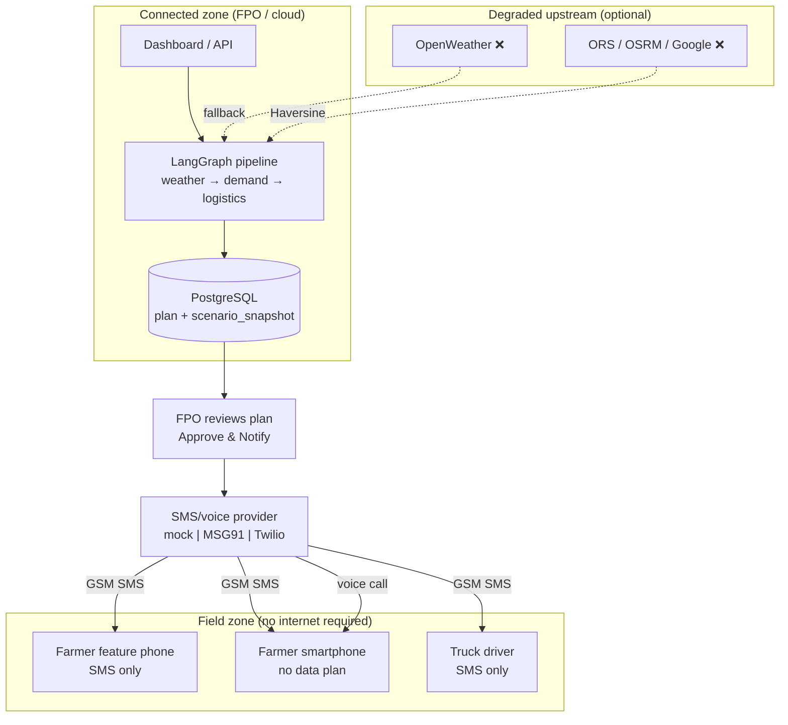

**Why this matters during an internet outage**

1. **Upstream outage** — Routing APIs and OpenWeather may fail; the system still produces routes (§3) and risk scores (§2). SMS carries the *result* of that degraded planning to people who would otherwise be uninformed.
2. **Downstream isolation** — Even when the control room *has* internet, farmers in remote blocks often do not. Notifications are the primary channel, not a nice-to-have.
3. **Spoilage clock keeps ticking** — Inventory urgency (< 24 h / < 12 h thresholds) does not wait for connectivity to return. Voice + SMS escalate time-critical pickups without requiring the farmer to poll a website.
4. **Human gate before blast** — Because upstream fallbacks can produce imperfect plans (`human_review`, Haversine distances), the **FPO approval gateway** prevents auto-sending bad pickup instructions during a connectivity crisis.

### 15.2 End-to-end flow

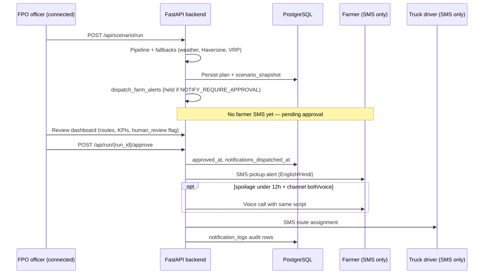

**FPO approval gateway (default):** notifications are **held** until the officer clicks **Approve & Notify** on the dashboard (`POST /api/run/{run_id}/approve`). After approval, alerts send even when `human_review` is true — the officer explicitly overrides the automated caution flag.

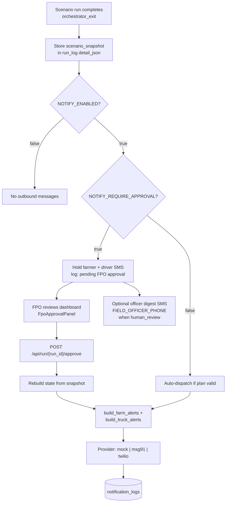

### 15.3 Who gets what

| Recipient | Channel | When | Message content |
|-----------|---------|------|-----------------|
| **Farmer** (routed, `notify_opt_in`, has `phone`) | SMS | Spoilage &lt; `NOTIFY_SPOILAGE_HOURS` (default 24 h), or all routed if `NOTIFY_ALL_ROUTED=true` | Truck ID, pickup time, kg, crop, mandi, weather note |
| **Farmer** (urgent) | SMS + voice | Spoilage &lt; `NOTIFY_VOICE_SPOILAGE_HOURS` (default 12 h) and `notify_channel` is `both` or `voice` | Same script read aloud (English/Hindi) |
| **Truck driver** (`driver_phone`) | SMS | After FPO approve | Route summary: farms, mandis, stop count, start time |
| **Field officer** | SMS (optional) | Before approve, if `human_review` and `FIELD_OFFICER_PHONE` set | Digest: urgent farm count, validation issues |

Farm and truck records carry contact fields (`phone`, `driver_phone`, `preferred_language`, `notify_channel`, `notify_opt_in`). Demo fixtures and `demo_contacts.py` back-fill missing phones for local testing.

**Alert eligibility (farmers)**

- Must appear on a **route stop** with `notify_opt_in=true` and a phone number.
- Default: only farms with **&lt; 24 h until spoilage** receive SMS (configurable). Set `NOTIFY_ALL_ROUTED=true` to notify every routed farm regardless of spoilage window.
- `notify_channel=none` → excluded entirely.

**Templates** (`backend/tools/notifications/templates.py`)

- **English / Hindi** SMS capped at 160 characters; includes urgency line and weather disclaimer when upstream weather used stale/synthetic fallback.
- Example SMS: *"Kisan Mitra: Nandi Valley - Truck tr-001 pickup ~6:30 AM. Send 1200kg tomato to Yeshwanthpur APMC. URGENT: spoilage in 8h."*

### 15.4 Configuration

| Variable | Default | Purpose |
|----------|---------|---------|
| `NOTIFY_ENABLED` | `false` | Master switch; set `true` to send (mock logs or real provider) |
| `NOTIFY_PROVIDER` | `mock` | `mock` (stdout log), `msg91`, or `twilio` |
| `NOTIFY_REQUIRE_APPROVAL` | `true` | Hold alerts until `POST .../approve` |
| `NOTIFY_SPOILAGE_HOURS` | `24` | SMS threshold (hours until spoilage) |
| `NOTIFY_VOICE_SPOILAGE_HOURS` | `12` | Voice escalation threshold |
| `NOTIFY_ALL_ROUTED` | `false` | If `true`, SMS all routed farms, not only urgent |
| `FIELD_OFFICER_PHONE` | `""` | Optional pre-approval digest when `human_review` |
| `MSG91_TEMPLATE_ID` | — | DLT template for MSG91 (production India) |

**API endpoints**

| Method | Path | Purpose |
|--------|------|---------|
| `POST` | `/api/run/{run_id}/approve` | FPO sign-off → dispatch notifications |
| `GET` | `/api/run/{run_id}/notifications` | Audit log of sent/failed messages |
| `GET` | `/api/run/{run_id}` | Includes `approval_status`, `approved_at`, `notifications_dispatched_at` |

**Approval status values:** `pending` → `approved` (after approve, before dispatch completes) → `dispatched`.

### 15.5 Behaviour matrix

| Condition | Behaviour |
|-----------|-----------|
| `NOTIFY_ENABLED=false` | No outbound messages; pipeline unaffected |
| `NOTIFY_REQUIRE_APPROVAL=true` (default) | Farmer/truck SMS **held** after run; officer must approve |
| Before FPO approval | No farmer/driver SMS; optional officer digest if `human_review` |
| After `POST .../approve` | Notify routed farms + truck drivers; **FPO overrides** `human_review` block |
| `human_review` + invalid plan (pre-approve) | Alerts skipped; officer digest only |
| Empty routes / `pipeline_blocked` | No alerts |
| Run without `scenario_snapshot` (old runs) | Approve returns **422** — re-run scenario after upgrade |
| Provider failure | Logged to `notification_logs` with `status=failed`; approve still completes |
| Internet outage at **provider** | SMS gateway may fail; audit log records failure; retry requires new approve flow or manual resend (future) |

### 15.6 Observability

| Signal | Location | Meaning |
|--------|----------|---------|
| `approval_status` | `GET /api/run/{id}` | `pending` / `approved` / `dispatched` |
| `notifications_dispatched_at` | Plan row | Timestamp of last dispatch |
| `notification_logs` table | DB / `GET .../notifications` | Per-message audit: phone, channel, status, body |
| Backend stdout (mock) | Docker / uvicorn logs | `MOCK SMS → +91…` / `MOCK VOICE → +91…` |
| `FpoApprovalPanel` | Dashboard | Status badge + **Approve & Notify** button |

### 15.7 Modules & tests

| Area | File |
|------|------|
| Alert building | `backend/tools/notifications/alert_builder.py` |
| Templates (en/hi) | `backend/tools/notifications/templates.py` |
| Dispatch + officer digest | `backend/tools/notifications/dispatcher.py` |
| FPO approve gateway | `backend/tools/notifications/approval.py` |
| State rebuild from snapshot | `backend/tools/notifications/run_state.py` |
| Mock provider | `backend/tools/notifications/providers/mock.py` |
| Post-run hook | `backend/agents/orchestrator.py` |
| Approve API | `backend/routes/runs.py` |
| Dashboard UI | `frontend/src/components/Dashboard/FpoApprovalPanel.jsx` |

```bash
cd backend
pytest tests/test_notifications -q
```

**Local test checklist**

1. Set `NOTIFY_ENABLED=true` and `NOTIFY_PROVIDER=mock` in `.env`; rebuild/restart backend (Docker or uvicorn — not both on port 8000).
2. Run a scenario from the dashboard (creates `scenario_snapshot`).
3. Click **Approve & Notify** → expect `MOCK SMS` lines in backend logs and rows in `GET /api/run/{id}/notifications`.

---

## Related documents

- [ARCHITECTURE.md](ARCHITECTURE.md) — Pipeline topology and condensed fallback overview  
- [README.md](README.md) — Quick start, agent roles, environment variables
