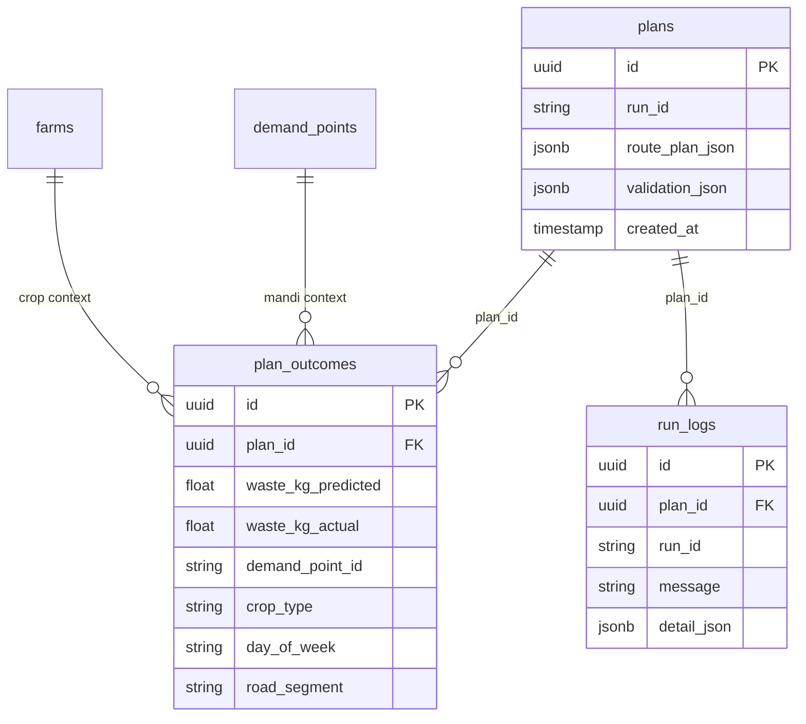

# AgentFarm Optimizer — Implementation Audit Report

**Audit date:** May 2026  
**Repository:** `Unysis_AgentFarm`  
**Auditor role:** Senior full-stack architect / technical reviewer  
**Scope:** Read-only analysis of actual codebase vs documented intent  
**Constraint:** No code changes were made to produce this report.

---

## A. Executive Summary

**AgentFarm Optimizer** is a **demo-ready, multi-agent agri-supply-chain planning platform** for India. It runs a **LangGraph-orchestrated pipeline** (weather + demand in parallel → inventory → OR-Tools logistics → rule-based validator with retries) behind a **FastAPI** backend and a **Next.js** dashboard with map, KPIs, mandi/farmer/transport views, and a separate **Farmer Advisor** chat.

The product is **not** a generic AI platform with auth, vector RAG, or production multi-tenancy. It is a **focused hackathon / innovation-program prototype** using **synthetic seed data** (20 farms, 10 mandis, 10 trucks) and optional external APIs (OpenWeather, Google Maps, OpenRouter/OpenAI).

| Dimension | Assessment |
|-----------|------------|
| **Overall product completion** | **~78%** for stated demo scope |
| **Core pipeline (agents + VRP)** | **Strong** — real LangGraph, real OR-Tools, real validator |
| **Documentation honesty** | **Good** after README rewrite (no LangChain/vector claims) |
| **Production readiness** | **Low** — no auth, open CORS, demo fixtures, thin automated tests |
| **Evaluator risk** | Docker/network flakes, optional API keys, KPI % varies by scenario |

---

## 1. Repository Structure Analysis

### 1.1 Top-level layout

```
Unysis_AgentFarm/
├── backend/           # Python 3.11 FastAPI + LangGraph + agents + tools
├── frontend/          # Next.js 14 pages router UI
├── data/              # Seed CSVs (farms, demand, trucks, outcomes)
├── scripts/           # validate_demo.sh / .ps1 (pre-demo health checks)
├── docker-compose.yml # 4 services: postgres, redis, backend, frontend
├── .env.example       # API keys + DB/Redis URLs
├── README.md          # Primary operator documentation
├── IMPLEMENTATION.md  # This audit (you are here)
├── LICENSE            # MIT
└── .github/workflows/ # CI: test, lint, deploy (deploy mostly TODO)
```

**Deleted / absent (verified):** `ARCHITECTURE.md`, `CONTRIBUTING.md`, `plan.md` — removed in recent commits; README is now the single architecture source.

**Not found:** `Project_Explaination.docx` (never in repo or removed earlier).

### 1.2 Major folders — purpose

| Path | Purpose |
|------|---------|
| `backend/main.py` | FastAPI app entry, lifespan (DB init, seed, Redis ping), routers, `/health` |
| `backend/graph.py` | LangGraph `StateGraph` compile + `run_scenario()` public API |
| `backend/agents/` | Seven agent modules + `review_flags.py` |
| `backend/memory/` | Tier-1 `state.py`, Tier-2 `outcome_store.py`, Tier-3 `session_buffer.py` |
| `backend/tools/` | `weather_api`, `maps_api`, `vrp_solver`, `db`, `scenario_effects`, `weather_summary` |
| `backend/models/` | Pydantic `schemas.py` + SQLAlchemy `db_models.py` |
| `backend/routes/` | HTTP: scenario, runs, advisor (+ outcome log on advisor router) |
| `backend/tests/` | `test_pipeline_smoke.py`, `conftest.py` |
| `backend/scripts/` | Manual smoke/compare/validator tests (not full CI suite) |
| `backend/requirements.in` | Direct deps (source of truth) |
| `backend/requirements.txt` | **Locked** tree via `pip-compile` |
| `frontend/src/pages/` | `index`, `scenario`, `dashboard`, `advisor`, `runs` |
| `frontend/src/components/` | Map, KPI, simulation, scenario builder, mandi, transport, advisor |
| `frontend/src/utils/demoFixtures.js` | **Embedded** 20/10/10 demo payload (not loaded from API) |
| `data/*.csv` | Postgres seed + outcome learning demo history |

### 1.3 Application entry points

| Layer | Entry |
|-------|--------|
| **Backend HTTP** | `backend/main.py` → uvicorn `main:app` (Docker CMD port 8000) |
| **Pipeline** | `backend/graph.py` → `compiled_graph.ainvoke()` via `run_scenario()` |
| **Frontend** | `frontend/src/pages/_app.js` (wraps `AppContextProvider`) → routes in `pages/` |
| **Docker** | `docker compose up -d --build` from repo root |

### 1.4 How to run locally

1. Copy `.env.example` → `.env`, set `OPENAI_API_KEY` (recommended).
2. `docker compose up -d --build` (first build **10–20 min** for OR-Tools/LangGraph wheels).
3. Open http://localhost:3000 → **Scenario** → run → **Dashboard** / **Advisor**.

**Without Docker:** Postgres + Redis locally; `uvicorn` in `backend/`, `npm run dev` in `frontend/` (see README).

**Hot reload:** `docker-compose.yml` mounts `./backend:/app` — Python code changes apply without image rebuild; dependency changes need rebuild.

---

## 2. Tech Stack Detection

| Category | Detected in repo | Matches README / intent? |
|----------|------------------|---------------------------|
| **Frontend** | Next.js 14.2.3, React 18, Tailwind 3, Leaflet/react-leaflet, Recharts, Axios | Yes |
| **Backend** | FastAPI, Python 3.11, Pydantic v2, pydantic-settings | Yes |
| **Orchestration** | **LangGraph** 0.2.62 (`StateGraph`, conditional edges, parallel nodes) | Yes |
| **LangChain** | **Not imported** in application code; `langchain-core` only as transitive dep | README correctly omits it |
| **Database** | PostgreSQL 16, SQLAlchemy 2 async, asyncpg | Yes |
| **Cache / sessions** | Redis 7 (weather, distance matrix, advisor chat) | Yes |
| **Optimization** | Google OR-Tools 9.11 (CVRP + distance dimension) | Yes (not CVRPTW in solver) |
| **LLM** | OpenAI Python SDK → OpenRouter or OpenAI (`gpt-4o-mini`) | Yes, optional |
| **Vector DB / RAG** | **None** | Correctly absent from README |
| **External APIs** | OpenWeatherMap, Google Distance Matrix (optional) | Yes |
| **Package managers** | pip (+ pip-tools lockfile), npm | Yes |
| **Testing** | pytest + pytest-asyncio (1 smoke test); frontend `npm run lint` only | Partial vs CI expectations |
| **CI** | GitHub Actions: backend pytest+cov, frontend build | Backend CI runs full pytest dir — **only 1 test file** |
| **Deploy** | `deploy.yml` has TODO placeholders (no real registry deploy) | Not production-deployed |

---

## 3. End-to-End Architecture

### 3.1 Narrative flow

1. **User** opens Scenario page, picks scenario type (monsoon / heat / normal / capacity_stress demo).
2. **Frontend** sends `POST /api/scenario/run` with **embedded** `demoFixtures` farms/mandis/trucks (+ stress trucks for capacity demo).
3. **FastAPI** builds `PipelineRequest` → **`run_scenario()`** invokes LangGraph.
4. **Graph:** orchestrator entry → **parallel** weather + demand → merge → inventory → logistics (OR-Tools) → validator → (retry loop) → orchestrator exit → persist KPIs node.
5. **Response** returns plan, KPIs, traces, weather summary, at-risk stock → stored in **localStorage** + `AppContext.runId`.
6. **Dashboard** reads cached response + optional `GET /api/run/{id}` for persisted plan.
7. **Advisor** (separate page) `POST /api/advisor/query` with `run_id` + `session_id` → loads plan from Postgres run logs → LLM or rule fallback.

**No authentication** anywhere. **No file upload** in UI (CSV seed exists only for DB init).

### 3.2 Mermaid — implemented system

```mermaid
flowchart TB
  subgraph User
    U[Browser]
  end

  subgraph Frontend["Next.js :3000"]
    P0[index / landing]
    P1[scenario.js]
    P2[dashboard.js]
    P3[advisor.js]
    P4[runs.js]
    DF[demoFixtures.js]
    LS[(localStorage)]
  end

  subgraph API["FastAPI :8000"]
    R1[POST /api/scenario/run]
    R2[GET /api/run/id]
    R3[GET /api/run/id/traces]
    R4[POST /api/advisor/query]
    R5[POST /api/outcome/log]
    H[/health]
  end

  subgraph LG["LangGraph compiled_graph"]
    E[orchestrator_entry]
    W[weather_agent]
    D[demand_agent]
    M[merge]
    I[inventory_agent]
    L[logistics_agent]
    V[validator]
    RP[retry_prep]
    X[orchestrator_exit]
    PS[persist_node]
    E --> W
    E --> D
    W --> M
    D --> M
    M --> I --> L --> V
    V -->|valid| X
    V -->|retry| RP --> L
    X --> PS
  end

  subgraph External["Optional APIs"]
    OWM[OpenWeatherMap]
    GMAP[Google Maps DM]
    LLM[OpenRouter / OpenAI]
  end

  subgraph Data
    PG[(PostgreSQL)]
    RD[(Redis)]
  end

  U --> P0 & P1 & P2 & P3
  P1 --> DF
  P1 -->|runScenario| R1
  P1 --> LS
  P2 --> LS
  P2 --> R2
  P3 --> R4
  R1 --> LG
  W --> OWM
  W --> RD
  D --> LLM
  D --> PG
  I --> LLM
  L --> GMAP
  L --> RD
  L --> ORT[OR-Tools CVRP]
  R4 --> LLM
  R4 --> PG
  R4 --> RD
  PS --> PG
  X --> PG
```

### 3.3 Flows not present

| Flow | Status |
|------|--------|
| Authentication / authorization | **Missing** |
| File upload / document RAG | **Missing** |
| Admin / human-review UI | **Flag only** (`human_review` in API response; no reviewer queue UI) |
| Multi-run history API | **Missing** (`GET /api/runs` list not implemented; runs page uses last cached run) |
| Real-time WebSocket agent streaming | **UI simulates** progress from trace replay, not live SSE |

---

## 4. Feature Implementation Audit

| Feature | Status | Key files | Working | Gaps |
|---------|--------|-----------|---------|------|
| LangGraph parallel weather+demand | **Fully implemented** | `graph.py` | Fan-out + merge + trace delta wrapper | — |
| Validator retry loop (max 2) | **Fully implemented** | `validator.py`, `graph.py`, `review_flags.py` | Retries, demand_scale, human_review semantics | — |
| OR-Tools route optimization | **Fully implemented** | `vrp_solver.py`, `logistics_agent.py` | CVRP + greedy fallback | Not CVRPTW; sync solve blocks event loop |
| Rule-based validator | **Fully implemented** | `validator.py` | 5 checks, real failures | “Time windows” = post-solve availability estimate |
| Weather agent | **Partial** | `weather_api.py`, `weather_agent.py` | Live API + Redis cache + scenario overlay | No key → synthetic overlay |
| Demand agent | **Partial** | `demand_agent.py` | Festival rules, bias from outcomes | LLM optional; empty history on fresh DB weakens learning |
| Inventory agent | **Partial** | `inventory_agent.py` | Shelf-life table + scenario factors | LLM optional; README once said “Postgres” — uses state only |
| Logistics scenario matrix tweaks | **Fully implemented** | `scenario_effects.py`, `logistics_agent.py` | Monsoon/heat distance bias | — |
| KPI vs naive baseline | **Fully implemented** | `metrics.py` | Computed every run | % is seed-dependent, not field truth |
| Plan persistence | **Fully implemented** | `tools/db.py`, `orchestrator.py` | plans + run_logs JSONB | Graceful skip if DB fails |
| Tier-2 outcome store | **Partial** | `outcome_store.py`, `data/sample_outcomes.csv` | SQL filters for demand/route history | No embeddings; seeded not live-logged from UI |
| Tier-3 advisor sessions | **Fully implemented** | `session_buffer.py` | Redis 10-msg / 24h TTL | — |
| Farmer Advisor LLM Q&A | **Partial** | `advisor_agent.py` | Plan context + gpt-4o-mini | Rule fallback only for shortage regex; needs API key for rich answers |
| Scenario builder UI | **Fully implemented** | `ScenarioForm.jsx`, `ScenarioTypeSelect.jsx` | 4 scenario types | **No CSV upload** — fixtures only |
| Agent simulation panel | **Fully implemented** | `SimulationPanel.jsx` | Trace-driven steps | Playback timing, not live backend stream |
| Dashboard map + polylines | **Fully implemented** | `InnerMap.jsx`, `RoutePolyline.jsx` | India-centric cluster | Needs OSM tiles online |
| KPI cards | **Fully implemented** | `KPIGrid.jsx` | From API `kpis` | — |
| Farmer / Mandi / Transport tabs | **Fully implemented** | `dashboard.js`, mandi/transport components | Derived from plan + fixtures | — |
| Weather source banner | **Fully implemented** | `WeatherSourceBanner.jsx` | Live vs simulated | — |
| capacity_stress retry demo | **Fully implemented** | `scenario_effects.py`, `DEMO_TRUCKS_CAPACITY_STRESS` | Undersized fleet | Weather effects = normal_day |
| Outcome logging API | **Backend only** | `routes/advisor.py` | `POST /api/outcome/log` works | **No frontend** caller |
| CSV scenario upload | **Missing** | — | — | Was in old docs |
| LangGraph skip/cached routes | **Missing** | — | — | Listed as future in old ARCHITECTURE |
| Vector / pgvector memory | **Missing** | — | — | — |
| User authentication | **Missing** | — | — | — |
| Human review workflow UI | **Missing** | `human_review` flag only | In API response | No reviewer dashboard |
| Multi-run list | **Missing** | `runs.js` comment | Single cached run | No `GET /api/runs` |
| Production deploy | **Partial** | `deploy.yml` | CI build | Deploy steps are TODO |

---

## 5. Planned vs Actual Comparison

*Inferred from README, code comments, routes, and removed plan.md patterns.*

| Planned / documented intent | Actual implementation | Status |
|---------------------------|----------------------|--------|
| Multi-agent orchestration | LangGraph with parallel + conditional retry | ✅ |
| 6–7 agents | 6 pipeline roles + advisor service | ✅ |
| OpenWeather + Redis cache | Implemented with fallback | ⚠️ |
| Google Maps distances | Implemented with Haversine fallback | ⚠️ |
| OR-Tools VRP | CVRP + capacity + distance cap | ⚠️ (not CVRPTW in solver) |
| Time windows in solver | Validator availability check only | 🔶 Overclaimed in old docs |
| LangChain integration | Not used | ❌ |
| Vector / pgvector memory | Not used | ❌ |
| CSV upload scenarios | Removed; demoFixtures only | ❌ |
| Three-tier memory | State + SQL outcomes + Redis sessions | ⚠️ (no vector tier) |
| Outcome feedback loop | API + seed data; no UI | ⚠️ |
| Advisor decoupled from graph | Yes | ✅ |
| Human review after max retries | Flag + semantics fixed | ⚠️ (no UI) |
| 20–60% waste reduction demo | KPI engine works; % varies | ⚠️ (synthetic) |
| Skip demand/logistics when cached | Not built | ❌ |
| Auth / multi-tenant | Not built | ❌ |
| `<2 min` pipeline for 20 farms | ~35–90s typical | ✅ (order of magnitude) |

**Extra features added beyond minimal plan:** Dashboard mandi fulfilment cards, transport route explanations, weather risk panel, validator retry trace UI, `capacity_stress` demo scenario, validate_demo scripts, pip-compile lockfile.

---

## 6. API and Backend Audit

| Method | Route | Purpose | Auth | Real logic? | Validation / errors |
|--------|-------|---------|------|-------------|---------------------|
| GET | `/health` | Liveness | No | Yes | Returns `{"status":"ok"}` |
| POST | `/api/scenario/run` | Full pipeline | No | **Yes** — `run_scenario()` | Pydantic body; 500 on exception |
| GET | `/api/run/{run_id}` | Persisted plan | No | **Yes** — DB | 404 if missing |
| GET | `/api/run/{run_id}/traces` | Agent traces | No | **Yes** — from run_log `detail_json` | Fallback to raw logs |
| POST | `/api/advisor/query` | Advisor Q&A | No | **Yes** — plan + LLM/rules | 500 on exception |
| POST | `/api/outcome/log` | Log outcome | No | **Yes** — inserts `plan_outcomes` | Pydantic `PlanOutcome`; 500 on error |

**Request/response notes:**

- **`POST /api/scenario/run`:** Body = `scenario_type`, `farms[]`, `demand_points[]`, `trucks[]`. Response includes `run_id`, `plan`, `kpis`, `agent_traces`, `human_review`, `demand_forecast`, `at_risk_stock`, `weather_summary`, `weather_risk_summary`.
- **`POST /api/advisor/query`:** `{ run_id, session_id, question }` → `{ answer, sources, run_id, session_id }`.
- **Issues:** No rate limiting; CORS `*`; global exception handler may leak exception strings; no API versioning.

---

## 7. Frontend Audit

| Page / area | Purpose | Data source | Mock vs real |
|-------------|---------|-------------|--------------|
| `index.js` | Landing + nav | Static | Static |
| `scenario.js` | Run pipeline + simulation | `POST /api/scenario/run` | **Real API**; payload from `demoFixtures.js` |
| `dashboard.js` | KPIs, map, farmer/mandi/transport | `localStorage` last response + optional GET run | **Real** when run completed |
| `advisor.js` | Chat | `POST /api/advisor/query` | **Real**; needs `currentRunId` |
| `runs.js` | Plan viewer | Cached response + `useRun` / `useRunTraces` | **Real**; single-run only |

**State management:** React Context (`AppContext.js`) + localStorage + per-hook `useState` (`useScenario`, `useRuns`, `useAdvisor`). No Redux/Zustand.

**Dead / disconnected UI:**

- `logOutcome` in `client.js` — **exported, never used**.
- `scenarioDraft.farms` in context — **not populated** from CSV (always empty arrays in draft).

**UX notes:** Large `dashboard.js` (~1200 lines) — maintainability risk. Map warns if routes empty. Simulation panel animates from traces (good for demo).

---

## 8. Database / Data Model Audit

### 8.1 Entities (PostgreSQL)

| Table | Purpose |
|-------|---------|
| `farms` | Seed reference farms |
| `demand_points` | Mandis / demand nodes |
| `trucks` | Fleet capacity + availability times |
| `plans` | `route_plan_json`, `validation_json`, `run_id` |
| `run_logs` | Pipeline logs; `detail_json` holds KPIs + **agent_traces** |
| `plan_outcomes` | Historical actuals for learning (Tier-2) |

### 8.2 ER diagram (Mermaid)



### 8.3 Gaps

- **No Alembic migrations** — schema via `create_all` + manual `ALTER TABLE IF NOT EXISTS` in `db.py`.
- **`weather_summary`** built in `run_scenario()` return path but **may be empty** in `orchestrator_exit` persist `detail_json` (`state.get("weather_summary")` not set on `AgentFarmState`) — advisor reloading **only from DB** may lack full weather summary unless traces/KPI carry it. **Needs verification** on advisor after page refresh without localStorage.
- Trucks/farms in scenario runs come from **request body**, not DB reads (DB seed for advisor name maps and outcomes only).

---

## 9. AI / ML / LLM Pipeline Audit

| Component | Provider | When used | Fallback | Stored? |
|-----------|----------|-----------|----------|---------|
| Demand agent | `gpt-4o-mini` temp=0 | Optional multipliers | Festival + weather rules | In state + run_log |
| Inventory agent | `gpt-4o-mini` temp=0 | Optional re-rank | Sort by `hours_until_spoilage` | In state |
| Advisor | `gpt-4o-mini` temp=0.3 | Per question | Regex mandi shortage + generic message | Redis session + reply only |
| Weather | OpenWeather API | If `OPENWEATHER_API_KEY` | Synthetic + scenario overlay | Redis cache 20min |
| Logistics | OR-Tools | Always | Greedy nearest-neighbor | `route_plan` in DB |
| Validator | None | Always | — | `validation_result` |

**Prompt structure (Advisor):** Rich system prompt with farm list, mandi rows, routes, weather line, validation line, waste % — instructs model to use **only** plan data (`advisor_agent.py` `_build_system_prompt`).

**Production readiness:** **Demo-level** — no prompt versioning, no guardrails beyond instructions, no cost/token budgets per tenant, sync OR-Tools in async path.

**LangGraph:** **Production-appropriate for orchestration prototype** — not a shallow wrapper; uses conditional edges and parallel execution correctly.

---

## 10. Hardcoded / Mock / Placeholder Detection

| File | Item | Problem | Recommended fix |
|------|------|---------|-----------------|
| `frontend/src/utils/demoFixtures.js` | Entire 20/10/10 dataset | Users cannot run custom farms without code change | Optional CSV upload or API to load from DB seed |
| `backend/tools/weather_api.py` | Scenario overlays when API down | Demo honesty OK if banner shown | Already has `WeatherSourceBanner` |
| `backend/agents/metrics.py` | Comments on 100% reduction with seed geometry | Presenter may overclaim % | Script/compare_scenarios for talking points |
| `backend/memory/session_buffer.py` L19 | Comment refs deleted `ARCHITECTURE.md` | Stale comment | Update comment |
| `frontend/src/pages/runs.js` L10–11 | Comment: future `/api/runs` | Feature gap | Implement list endpoint or remove page promise |
| `backend/agents/advisor_agent.py` | `_FALLBACK_REPLY` | Generic error UX | OK for demo |
| `.github/workflows/deploy.yml` | TODO deploy steps | No automated deploy | Implement or document manual deploy |
| `backend/tests/*` | Mocks only in smoke test | Low coverage | Expand pytest |
| `docker-compose.yml` | `agentfarm/agentfarm` credentials | Insecure for production | Expected for demo |

---

## 11. Bugs, Risks, and Missing Pieces

### Critical

| Issue | Detail |
|-------|--------|
| **No secrets in git** | Ensure `.env` never committed (gitignored); rotate if leaked |
| **CORS `allow_origins=["*"]` + credentials** | Misconfiguration pattern; acceptable demo-only |
| **Docker Hub / PyPI network** | Builds fail on `registry-1.docker.io` DNS or pip timeouts — environment not code |

### High

| Issue | Detail |
|-------|--------|
| **Blocking OR-Tools in async** | Can stall FastAPI under load |
| **Single pytest smoke test** | CI may pass with minimal coverage |
| **Advisor without run_id** | Chat shows RUN NONE |
| **weather_summary persist gap** | May affect advisor context from DB-only path |

### Medium

| Issue | Detail |
|-------|--------|
| **No auth** | Anyone with URL can run expensive pipeline |
| **Frontend `logOutcome` unused** | Learning loop not exposed |
| **Runs page single-run** | Misleading for “history” |
| **Stale comments** (ARCHITECTURE.md, CLAUDE.md refs) | Confusion for reviewers |
| **`.env.example` lists `PLANNING_TEMP`** | Not used in code (only `advisor_temp` in config) |

### Low

| Issue | Detail |
|-------|--------|
| **Large dashboard.js** | Refactor for maintainability |
| **OSM tile dependency** | Offline maps look empty |
| **colorama in lockfile** | Windows transitive; harmless |

---

## 12. Product Completion Percentages

| Area | % | Reasoning |
|------|---|-----------|
| **Frontend** | **85%** | All main pages work; missing CSV upload, outcome UI, run list |
| **Backend** | **88%** | Pipeline complete; thin auth, no run list API |
| **Database** | **80%** | Schema supports features; no migrations framework |
| **AI/ML logic** | **75%** | Real agents + OR-Tools; optional LLM; no vectors |
| **API integration** | **82%** | Core paths wired; outcome log disconnected in UI |
| **Authentication** | **0%** | Not in scope |
| **Dashboard / analytics** | **90%** | Rich tabs; synthetic KPIs |
| **Deployment readiness** | **45%** | Docker OK; CI partial; deploy.yml TODO |
| **Overall product** | **~78%** | Strong demo; not production SaaS |

---

## 13. Implementation Roadmap

### Phase 1 — Must-fix for working demo

| Task | Files | Priority | Difficulty | Outcome |
|------|-------|----------|------------|---------|
| Verify Docker build on clean machine | `README.md`, `docker-compose.yml` | P0 | Low | Evaluators can start stack |
| Document API key modes | README presenter script | P0 | Low | Honest live vs simulated narrative |
| Fix `weather_summary` in persist `detail_json` | `graph.py` or `orchestrator.py` | P1 | Low | Advisor works after refresh |
| Run `validate_demo.ps1` before demo | `scripts/` | P0 | Low | Confidence check |
| Rehearse advisor questions with key | — | P0 | Low | Avoid generic fallback |

### Phase 2 — Complete core product

| Task | Files | Priority | Difficulty |
|------|-------|----------|------------|
| `GET /api/runs` list endpoint | `routes/runs.py` | P1 | Medium |
| Wire outcome log in UI | `client.js`, new form | P2 | Medium |
| Optional: load scenario from DB seed API | `routes/`, `ScenarioForm` | P2 | Medium |
| Expand pytest (validator fail, scenarios) | `backend/tests/` | P1 | Medium |
| Run OR-Tools in thread pool | `logistics_agent.py` | P2 | Medium |

### Phase 3 — Production readiness

| Task | Priority | Difficulty |
|------|----------|------------|
| Alembic migrations | P1 | Medium |
| Restrict CORS + env-based origins | P1 | Low |
| API auth (API key header) | P2 | Medium |
| Rate limiting on `/scenario/run` | P2 | Medium |
| Complete `deploy.yml` or document Render/Fly | P2 | Medium |

### Phase 4 — Polish UI/UX and documentation

| Task | Priority | Difficulty |
|------|----------|------------|
| Split `dashboard.js` into tab modules | P2 | Medium |
| Human review banner when `human_review=true` | P1 | Low |
| Remove stale doc references in comments | P3 | Low |
| Add `IMPLEMENTATION.md` link in README | P3 | Low |

---

## 14. Final Deliverables

### C. Feature Status Table (summary)

| Status | Count (representative) |
|--------|-------------------------|
| Fully implemented | LangGraph, validator retry, OR-Tools, dashboard map/KPI/tabs, advisor service, Redis cache, Postgres persist |
| Partial | Weather, demand, inventory LLM paths, Tier-2 learning, CI tests |
| Mock / demo data | `demoFixtures.js`, synthetic weather fallback, seeded outcomes |
| Missing | Auth, vector DB, LangChain, CSV upload, skip edges, run list API, human review UI |
| UI only | — (most UI backed by API) |
| Backend only | `POST /api/outcome/log` |

### D. Missing Implementation Checklist

- [ ] `GET /api/runs` (list recent runs)
- [ ] Frontend outcome logging UI
- [ ] CSV / custom scenario input (or “load from seed” button)
- [ ] Human review queue / banner on dashboard
- [ ] Persist `weather_summary` into run_log consistently
- [ ] Alembic migrations
- [ ] Authentication (if required by program)
- [ ] Additional pytest coverage
- [ ] Production deploy pipeline
- [ ] OR-Tools async executor wrapper
- [ ] Remove stale documentation references in code comments

---

## Document control

| Item | Value |
|------|--------|
| Generated from branch | `v1` / `main` (post demo-readiness commit) |
| Code changes in this audit | **None** |
| Next step | User explicitly requests implementation of roadmap items |

---

*End of IMPLEMENTATION.md*
